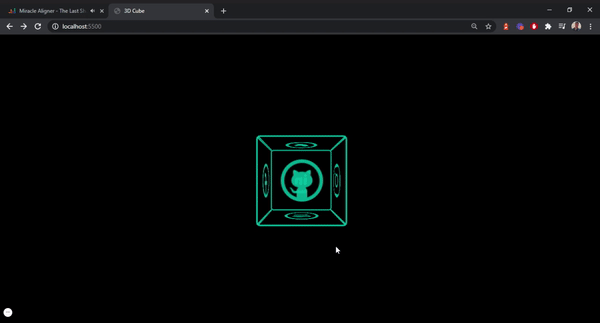

  

<h3 align="center">3D Cube Links</h3>

---

A simple 3d cube with links to your social medias
      

## 📌 Table of Contents

- [About](#about)
- [Built Using](#built_using)
- [Acknowledgments](#acknowledgement)
- [Authors](#authors)

## 💬 About 

Playing with javascript and css, the challenge of building a three-dimensional cube with links to my social media came to mind.

## 🛠 Built Using 

- HTML
- CSS
- JavaScript

## 🎯 Acknowledgements 

- 3D transforms
- DOM manipulation

## 🖌 Authors 

- [@alexandreespejo](https://github.com/alexandreespejo) - Idea & Initial work

Give a ⭐️ if you liked the project !
